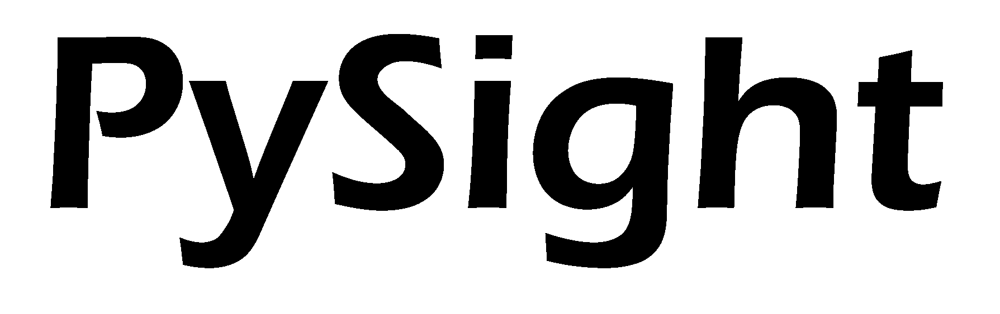

.. start-badges

.. list-table::
    :stub-columns: 1
    :align: center

    * - docs
      - |docs| |gitter|
    * - tests
      - | |travis| |codecov|
    * - package
      - | |version| |wheel| |supported_versions|
        | |supported_implementations|

.. |docs| image:: https://readthedocs.org/projects/python-pysight/badge/?style=flat
    :target: https://readthedocs.org/projects/python-pysight
    :alt: Documentation Status

.. |gitter| image:: https://badges.gitter.im/python-pysight/gitter.png
            :target:  https://gitter.im/python-pysight/Lobby
            :alt: Gitter Chat

.. |travis| image:: https://travis-ci.org/PBLab/python-pysight.svg?branch=master
    :alt: Travis-CI Build Status
    :target: https://travis-ci.org/PBLab/python-pysight

.. |codecov| image:: https://codecov.io/github/PBLab/python-pysight/coverage.svg?branch=master
    :alt: Coverage Status
    :target: https://codecov.io/github/HagaiHargil/python-pysight

.. |version| image:: https://img.shields.io/pypi/v/pysight.svg
    :alt: PyPI Package latest release
    :target: https://pypi.python.org/pypi/pysight

.. |wheel| image:: https://img.shields.io/pypi/wheel/pysight.svg
    :alt: PyPI Wheel
    :target: https://pypi.python.org/pypi/pysight

.. |supported_versions| image:: https://img.shields.io/pypi/pyversions/pysight.svg
    :alt: Supported versions
    :target: https://pypi.python.org/pypi/pysight

.. |supported_implementations| image:: https://img.shields.io/pypi/implementation/pysight.svg
    :alt: Supported implementations
    :target: https://pypi.python.org/pypi/pysight

.. end-badges

Create images and volumes from photon lists generated by a multiscaler.

    - Free software: Creative Commons

    - Created in `Pablo Blinder's Lab <http://pblab.tau.ac.il/en/>`_.

    - A preprint of the article by the package authors can be found  `here. <https://doi.org/10.1101/316125>`_

========
Contents
========

.. toctree::
   :maxdepth: 2

   installation
   usage
   nomultiscaler
   pysight
   contributing
   authors
   changelog

Indices and tables
==================

* :ref:`genindex`
* :ref:`modindex`
* :ref:`search`

