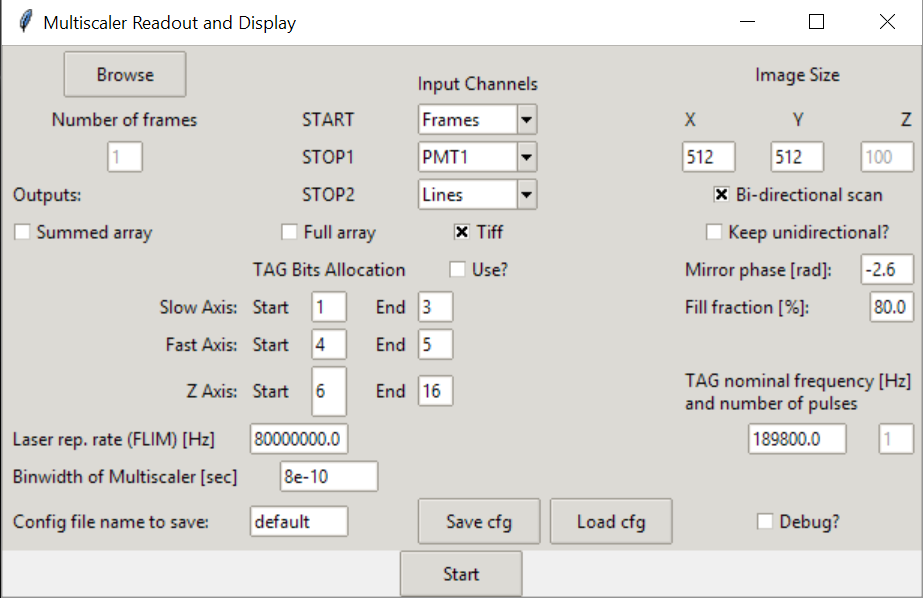

=====
Usage
=====

To use PySight do one of the following:

1. write a Python script containing::

    from pysight import main_multiscaler_readout

    df, movie = main_multiscaler_readout.run()

2. From the command line::

    python /path/to/pysight/dir/main_multiscaler_readout.py

This command will open a GUI in which you'll have to choose a ``.lst`` file to parse.

If you use option #1, The algorithm will create the pandas DataFrame ``df`` containing all data, and a ``movie`` object with allocated data. The output options are:

* ``single`` - The algorithm will create a single ``n``-dimensional matrix that is the sum of all photon events in the list file. Each dimension corresponds to a recorded physical axis - frames, lines, laser pulse, etc. The variable is called ``movie.summed``.
* ``array`` - Full-blown array containing all available data in separate frames\volumes, no aggregation like in ``single``. Access it from the ``.hist`` field of the generated object.
* ``tiff`` - Outputs a ``.tif`` file with the same name as the file, in the same folder.

Obviously, if you run the script from the command line (option #2) you can only interact with the ``.tif`` file.

GUI Options
-----------

Running **PySight** will open GUI seen above.

Choosing a ``.lst`` file for analysis is done with the *Browse* button, located at the top-left corner of the GUI.

The *Input Channels* option allows you to specify what was the input device to all three of the analog inputs of the multiscaler.
Note that at least one of these fields must be a ``PMT1`` entry.

To the right, *Image Size* determines the shape of the output matrix from the algorithm.
Below it you can check whether the mirrors acquired data in a bi-directional fashion.
You should also specify, in case data was acquired uni-directionally, whether the algorithm should keep the photons arriving during that returning phase.
Below, specify the phase delay of the scanners and fill fraction, to cancel pixel-shift and remove the non-linear area of the image, located in the edges.

At the bottom part of the GUI you can load a specific ``.json`` file to be used as a config file. A default ``default.json`` file is shipped with the package,
but other files can be saved and loaded easily, to allow easier use of the GUI. The full filename is also saved.

Some other options include:

* *Debug?*: Reads a relatively small portion of a file, allows for quick code-checking.

* *TAG Bit allocation*: When using the TAG bits you can determine what each bit is responsible for.

* *Laser repetition rate*: For FLIM.

* *Binwidth*: The binwidth, in seconds, of your model of the MCS6A.

Limitations
-----------

* List (``.lst``) files have to be saved in ``ASCII`` format, and not binary.

* The code currently supports only three input channels, and a single PMT channel.
