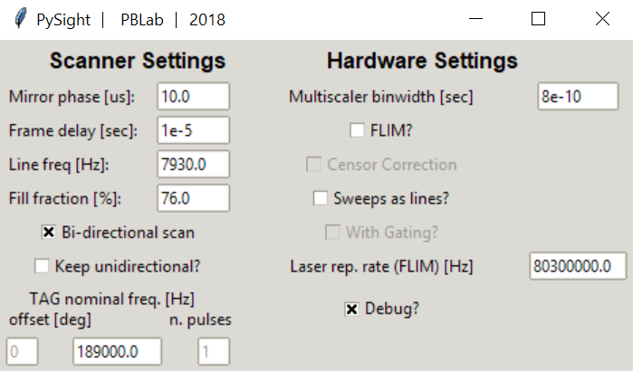

=====
Usage
=====

To use PySight do one of the following:

1. write a Python script containing::

    from pysight import main

    out = main.run()

2. From the command line::

    python /path/to/pysight/dir/main.py

3. For batch processing of multiple list files::

    import pysight

    foldername: str = r'/path/to/folder/with/list/files'
    glob_str: str = ''  # a glob-pattern string to filter files to parse. Default is '*.lst'
    recursive: bool = False  # Boolean whether to iterate over nested folders in the main folder
    cfg_file: str = r'/path/to/existing/cfg.toml'

    data_record = pysight.main.run_batch_lst(foldername=foldername, glob_str=globstr,
                                             recursive=recursive, cfg_file=cfg_fname)

4. For parallel execution of multiple list files::

    import pysight

    foldername: str = r'/path/to/folder/with/list/files'
    glob_str: str = ''  # a glob-pattern string to filter files to parse. Default is '*.lst'
    recursive: bool = False  # boolean whether to iterate over nested folders in the main folder
    n_process: int = None  # number of cores to uses. None means all available.
    cfg_file: str = r'/path/to/existing/cfg.toml'

    data_record = pysight.main.mp_batch(foldername=foldername, glob_str=globstr,
                                        cfg_file=cfg_fname, recursive=recursive,
                                        n_proc=n_process)

These command will open a GUI in which you'll have to choose either a ``.lst`` or a pickle (``.p``) file to parse. Alternatively, if you input a configuration file, generated by PySight, you skip the GUI.

If you use option #1, The algorithm will create a PySightOutput object which grants access to raw and processed data.
Other outputs come in the form of in-memory numpy arrays and ``.zarr`` compressed multidimensional files. The output options are:

* **In Memory** - The returned objects contain all photons and generated
  histograms. Use it if you wish to further process the data in Python,
  or view it using tools like `matplotlib <https://matplotlib.org/>`_ or
  `napari <napari.org>`_.
* **Full Stack** - PySight will save to disk a multidimensional histogram,
  one per spectral channel, with all of the events recorded.
  Dimensions are [t, x, y, z, tau].
* **Summed Stack** - PySight will sum the _t_ dimension of the Full Stack to
  received a summed projection over time of the entire experiment.

.. note:: If you run the script from the command line (option #2) or in batch mode you can only interact with the final ``.zarr`` files.

.. _gui:

GUI Options
-----------
.. image:: gui.png
   :scale: 75%

Running **PySight** will open the GUI seen above.

Choosing a ``.lst`` file for analysis is done with the *Browse* button, located at the top-left corner of the GUI.

The *Input Channels* option allows you to specify what was the input device to all three (supported) of
the analog inputs of the multiscaler. Note that at least one of these fields must be a ``PMT1`` entry.

To the right, *Image Size* determines the shape of the output matrix from the algorithm. The X dimension corresponds to the line signal,
and should correspond to the original signal fed into the multiscaler.
Below it you can specify the number of frames if a lines\frames signal wasn't captured.

*Imaging Software* should be specified when working with either ScanImage or MScan. PySight is tested on these two acquisition applications,
and thus might fail with data acquired using different software. Please page the package author in GitHub if you wish to integrate your acquisition into PySight.

*TAG Bit Allocation* specifies each bit's responsibility during the acquisition.

Lastly, At the bottom part of the GUI you can load a specific ``.toml`` file to be used as a config file. A default ``default.toml`` file is supplied with the package,
but other files can be saved and loaded easily, to allow easier use of the GUI. You may even create other configuration files manually,
using the ``default.toml`` file as your reference.

In the *Advanced* pop-up window, you can define more system parameters, including:

* *Mirror phase*: Corrects pixel-shift artifacts in bidirectional scanning.

* *Frame delay*: Time between subsequent frames. Used in *MScan* mode.

* *Line freq*: Resonant mirrors nominal frequency.

* *Fill fraction*: Percentage of time that the mirror spends inside the field of view. High values can cause distortions in the image - a typical value is in the low 70's.

* *Bidirectional scan*: Whether data was acquired in both forward and back phases of the resonant mirror.

* *Keep unidirectional?*: When in bidirectional mode, back phase photons are usually discarded. This option allows you to gain them back into the image. Make sure to set a proper value to the mirror phase parameter.

* *TAG nominal frequency?*: For acquisitions with the TAG lens. Leftmost entry - offset of the pulse. Middle - nominal frequency of the lens. Rightmost - number of pulses per period (currently only one is supported).

* *Binwidth*: The binwidth, in seconds, of your model of the MCS6A.

* *FLIM?*: Check if you wish to add another dimension in the output stack for the time-since-pulse of each photon. Multiscaler must have either a frequency divider connected to its "REF CLK" input (recommended) or a laser-clock signal in one of the analog outputs.

* *Sweeps as lines?*: You can omit the line signal if each sweep of the multiscaler corresponds to a line in the image. Usually it is not recommended to do so.

* *Laser repetition rate*: For FLIM.

* *Debug?*: Reads a relatively small portion of a file, allows for quick code-checking.

* *Interleaved?*: [EXPERIMENTAL] See :ref:`detailed explanation <interleaved>`.

.. warning:: There are two main limitations for PySight at the moment:

    * Timepatch ``3`` is currently supported only for binary files (and can usually be avoided completely).

    * 6-byte timepatches aren't supported in binary list files. As per FAST's recommendation, 6-byte formats should be disallowed in the MPANT settings.

Advanced
--------

You should also specify, in case data was acquired uni-directionally, whether the algorithm should keep the photons arriving during that returning phase.
Below, specify the phase delay of the scanners and fill fraction, to cancel pixel-shift and remove the non-linear area of the image,
located in the edges. Phase delay is only used in bidirectional mode.
